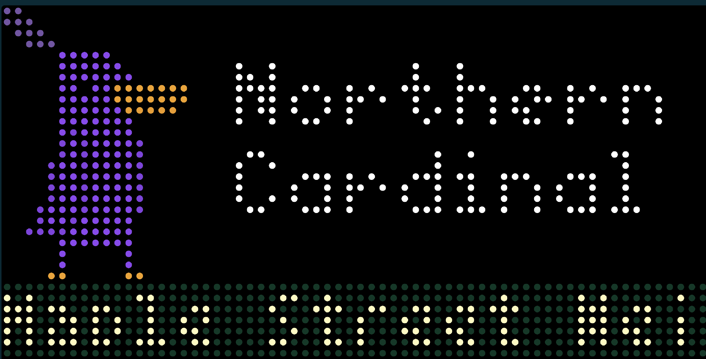

# Birdbyt

[Tidbyt](https://tidbyt.com/) app that displays recent bird sightings.

## Running birdbyt locally

To dev on this app against your own Tidbyt:

1. Install Pixlet: https://tidbyt.dev/docs/build/installing-pixlet 
2. Clone this repo and `cd birdbyt`
3. Make a copy of the sample .env file: `cp bin/.env_example bin/.env`
4. Fill in env variable values in `bin/.env` ([instructions for getting your Tidbyt device id](https://tidbyt.dev/docs/build/build-for-tidbyt#push-to-a-tidbyt))
5. Run script to generate image and push bird sightings to Tidbyt: `source <path to birdbyt code>/bin/push_to_birdbyt.sh`

## Credits

This project uses bird sighting data from the Cornell Lab of Ornithology: [eBird.org](https://ebird.org).

Purple duck assets by [nespy](https://nespy.itch.io/purple-duck-character-asset)
